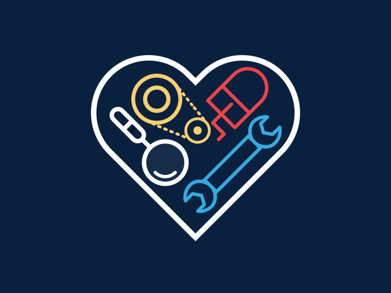

   

  

<h4 align="center"> |  |  |  </h4>

<!--    |  |  |
 -->

<!-- For resume -->
                                                                                                                                                              

  

     My Dream
  

  <ul>
      <li><i> Representing <b> Bangladesh </b> at the  GLOBAL Arena and wave the Flag </i>
      </li>
  </ul>

  

     Fun Fact
  

You don't need money to give a star    If you  like my readme , give it a star    😉😉

  

  <h1>  About Me </h1>
   
   

  <ul>
    <li style="margin-bottom: 7px;"><b>   <i> </i></b> </li>
    <li style="margin-bottom: 7px;"> </li>
    <li style="margin-bottom: 7px;"><b> </b></li>
    <li style="margin-bottom: 7px;"><b>  </b></li>
    <!-- <li style="margin-bottom: 7px;"><b> </b></li> -->
    <li style="margin-bottom: 7px;"><b> </b></li>
  </ul> 
   

- My Resume - <a href = "https://drive.google.com/file/d/1I9a2c-kg4D501A1PyovhlvmF93PW23V2/view?usp=drivesdk">

 

<h1>  Connect with Me</h1>

 
   
<ul>
  <li style="margin-bottom: 5px;"> </li>
  <li style="margin-bottom: 5px;">  </li>     
  <li style="margin-bottom: 5px;"> </li>
  <li style="margin-bottom: 5px;"></li>
  <li style="margin-bottom: 5px;"></li>
</ul>

<!--

### 🔝 Top Contributed Repo

-->

<!--
## 🏆 GitHub Trophies

// Most used language

-->
 

<h1>  ||  </h1>
  
<ul>
    <li style="margin-bottom: 12px;"> Represented my  <b>Institution </b> at <b>5x Onsite National Programming Competitions</b>  which includes <b>2x     Dhaka Regional Contest </b><a href = "https://icpc.global/ICPCID/DCRIAR9MRAEU"> <b>  </b></a> </b> </li>
    <li style="margin-bottom: 12px;"><b> Solved 1000+ algorithmic problems </b>on various coding platforms  <a href = "https://www.stopstalk.com/user/profile/khalid58"> <b>  </b></a></li>
    <li style="margin-bottom: 12px;"> Participated in <b>50+ Online Programming Competitions <a href = "https://www.stopstalk.com/user/profile/khalid58">  </b></a></li>
    <li style="margin-bottom: 12px;"><b>  </b>at Junior Intra University Programming Contest(IUPC) which included resposibilites such as  Preparing <a href = "https://github.com/khalid586/Problem-Setting/tree/main/Problem%20statements">Problem statements </a>, Writing <a href = "https://github.com/khalid586/Problem-Setting/tree/main/Solutions">Solutions </a> and <a href = "https://github.com/khalid586/Problem-Setting/tree/main/Test%20cases"> Test Cases  </a>   [ Contest Ref ➡️ </b>]
    </li>
    <li style="margin-bottom: 12px;"> Worked as an  at  BAIUST CSE FEST (Programming Contest Section)  <b>[Ref ➡️ ]</b></li>
    </li>
    <li style="margin-bottom: 12px;"> Conducted Workshops for 1st and 2nd   year students</li>
    <li style="margin-bottom: 12px;">  Junior Competitive Programmers of our University </li>
</ul>

 

<h1>  || </h1>

<ul>
  <li> <b>One of the Top Performers of OOP and Data Structure & Algorithms course</b></li>
  <li> Ranked <b> th</b> at Higher Secondary Certificate(HSC) Exam  2019 (Comilla Board)  <a href = "https://allrezultbd.files.wordpress.com/2019/12/hsc-scholarship-2019-final.pdf" alt = Ranklist>  <b> </b></a></li>
  <li> Ranked <b>23rd </b>at Physics Olympiad 2018 , Comilla Region (Higher Secondary Division) and Qualified for the National Round </li>
</ul>

 

  ||  

 
|Preview|Project Name|Framework|Source Code|Video Demo|Live server|
|-|-|-|-|-|-|
||Kazi Shop| | [Source code](https://github.com/khalid586/Kazi-Shop) |-|-|

 

  

<h1>  || </h1>

<ul align = "left">
    <li style="margin-bottom: 5px;"> Represented my  Department at the <b>Inter Department Debate Competition </b>  <a href = "https://github.com/khalid586/khalid586/blob/main/assets/Debate.gif"><b> </b></a></li>
    <li style="margin-bottom: 5px;"> Represented my  Department at the <b>Intra University Robo Soccer Competition</b> and <b>reached the Semi-Finals</b></li>
    <li style="margin-bottom: 5px;"> Participated in Global coding contest such as Google Kickstart , CodeJam and Facebook HackerCup</li>
    <li style="margin-bottom: 5px;"> Participated in several Online Hackathons</li>
    
    
    
</ul>

 

<h1>  ||  </h1>

<ul align = "left">
    <li style="margin-bottom: 5px;"> Ranked <b>   st  </b>(out of 20000+ registered participants) in Codechef October Challenge 2021 <a href = "https://www.codechef.com/rankings/OCT21C?filterBy=Country%3DBangladesh&itemsPerPage=100&order=asc&page=1&sortBy=rank "> <b></b> </a></li>
    <li style="margin-bottom: 5px;"> Ranked <b>th</b>(out of 165 QUALIFIED Teams) in  ICPC Asia Dhaka Regional 2021 Onsite Round <a href = "https://algo.codemarshal.org/contests/dhaka-21-main/standings"> <b></b> </a></li> 
    <li style="margin-bottom: 5px;"> Ranked <b>st</b>(out of 162 QUALIFIED Teams) in  ICPC Asia Dhaka Regional 2022 Onsite Round <a href = "https://algo.codemarshal.org/contests/dhaka-22/standings"> <b></b> </a></li> 
   <li style="margin-bottom: 5px;"> Ranked <b>th</b>(out of 1700+ registered teams) in  ICPC Asia Dhaka Regional online preli 2021 and qualified for Onsite Round <a href = "https://algo.codemarshal.org/contests/icpc-dhaka-21-preli/standings?page=2"> <b></b> </a></li> 
    <li style="margin-bottom: 5px;" > Ranked <b>th</b>(out of 1600+ registered teams) in  ICPC Asia Dhaka Regional online preli 2022 and qualified for Onsite Round </li> 
    <li style="margin-bottom: 5px;"> Ranked  <b>  th  </b>(out of 5000+ registered participants) in Codechef Code senso  <a href = "https://www.codechef.com/rankings/CSNS21C?filterBy=Country%3DBangladesh&itemsPerPage=100&order=asc&page=1&sortBy=rank"> <b></b> </a></li>
    <li style="margin-bottom: 5px;"> Ranked <b>   th </b>(out of 8500+ registered participants) in Codeforces Round 773 (Div. 2) <a href = "https://codeforces.com/contest/1642/standings/participant/128848941#p128848941">  <b></b></a>
    </li>
    <li style="margin-bottom: 5px;">Ranked <b>4th</b> at Intra University LFR competition</li>
    
    
</ul>

 

<h1> 
  ||
 </h1>

&nbsp;

 

<h1> 
  Language & Tools
 </h1>

- <b> Comfortable with </b> -         

- <b> Familiar with </b> -     

<!--         -->

<!--

