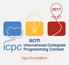
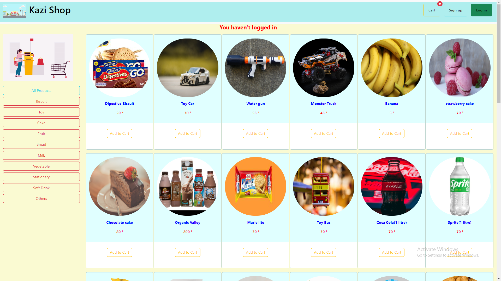
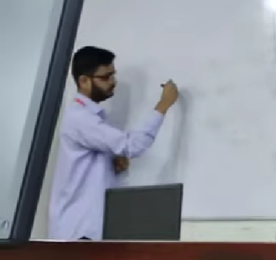
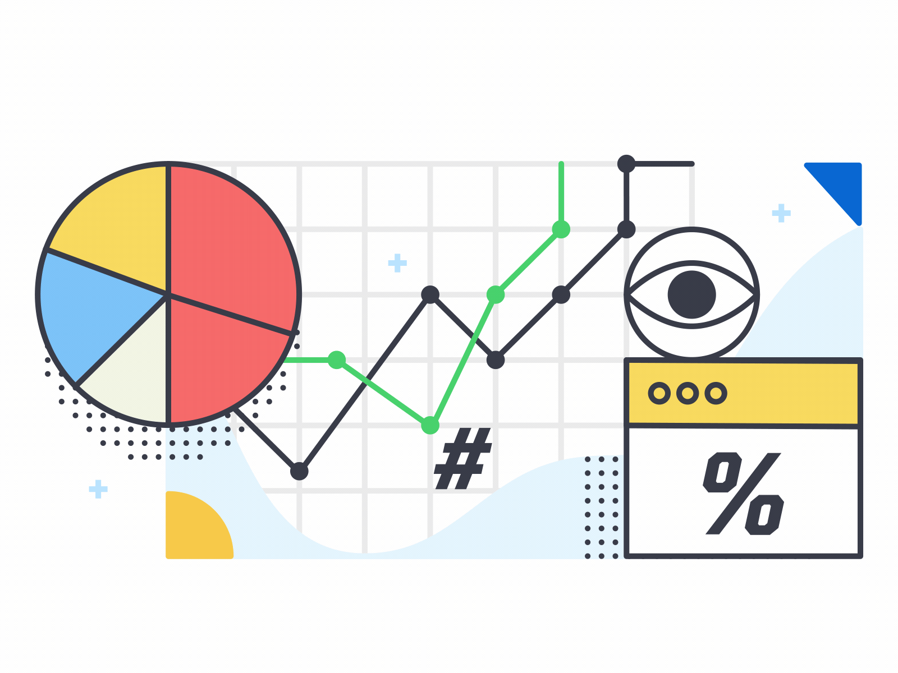
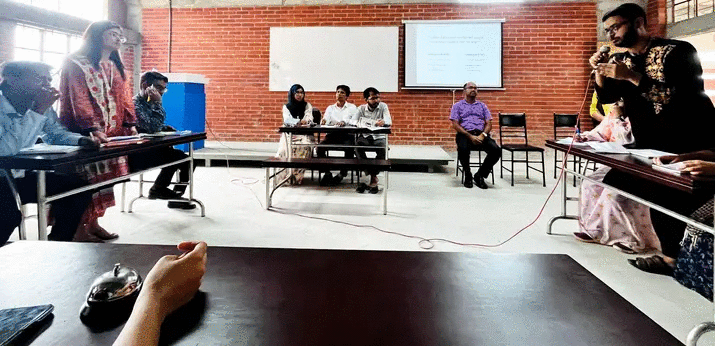
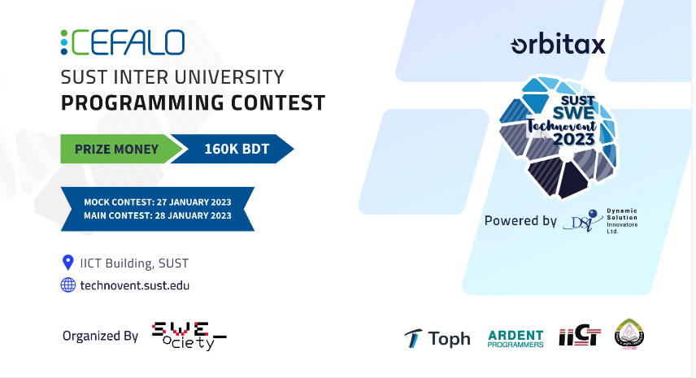

   

<h1 align = "center">  Khalid Abdullah </h1>

<!--    |  |  |
 -->

<!-- For resume -->

                                                                                                                                                           

  

     My Dream
  

  <ul>
      <li><i> Representing <b> Bangladesh </b> at the  GLOBAL Arena and wave the Flag </i>
      
  </ul>

  

     Fun Fact
  

You don't need money to give a star    If you  like my readme , give it a star    😉😉

  

 
# About Me 
   
   

  <ul>
    <li style="margin-bottom: 7px;"><b>  ACM ICPC Asia Regionalist</b> 
    <li style="margin-bottom: 7px;"> <b>Problem-Setter</b>
    <li style="margin-bottom: 7px;"><b> Programming Mentor</b>
    <li style="margin-bottom: 7px;"> <b>Competition Organizer </b>
    <!-- <li style="margin-bottom: 7px;"><b> </b> -->
    <li style="margin-bottom: 7px;"><b> Debater</b>
  </ul> 
   

- **My Resume** - 
- **My LinkedIn** - 
- **ICPC Credential** - 

 

# Connect with Me

 
   
<ul>
  <li style="margin-bottom: 5px;"> 
  <li style="margin-bottom: 5px;">       
  <li style="margin-bottom: 5px;"> 
  <li style="margin-bottom: 5px;">
  <li style="margin-bottom: 5px;">
</ul>

  

#  Projects

|Preview|Project Name|Frontend|Backend|Source Code|Video Demo|
|-|-|-|-|-|-|
||<b>Kazi Shop</b>| || [Source - Kazi Shop](https://github.com/khalid586/Kazi-Shop) ||
|-|<b>Blogging App</b>|   ||-|-|

 

<h2 align="center">👨‍💻 Must Check Repositories </h2>

|||
|-|-|
<!--       

 -->

#  Github Stats

<table>
      <thead>
            <tr>
                  <th>
                        

                  </th>
                  <th>
                        
 

                  </th>
            </tr>
      </thead>
</table>

 

#  Language & Tools

|Frontend|Backend|Database|Languages|Others|
|-|-|-|-|-|
|    |||     ||

 

<b>Experience</b>

<h1>   </h1>
  
  
 <b>Brief</b> 

- <b>Participated in ICPC Asia Dhaka regional `3 times`</b>
- <b> Solved `1000+` algorithmic problems </b>on various coding platforms
-  Participated in <b>`50+` Online Programming Competitions
- <b> Problemsetter at Junior IUPC</b>

-  Organizer at BAIUST CSE FEST (programming contest) 

-  Mentored Programmers of our campus
-  Conducted Workshops for 1st and 2nd   year students
</ul>

 

<b>Details</b>
|Events|Reference|
|-----|---------|
|Represented my  <b>Institution </b> at <b>6x Onsite National Programming Competitions</b>  which includes <b>`3x`    `ICPC Asia Dhaka Regional` Contest </b>||
|<b> Solved 1000+ algorithmic problems </b>on various coding platforms| <a href = "https://www.stopstalk.com/user/profile/khalid58"> <b>  </b></a>|
|Participated in <b>50+ Online Programming Competitions |<a href = "https://www.stopstalk.com/user/profile/khalid58">  </b></a>|
| </b>at  Junior Intra University Programming Contest(IUPC) which included resposibilites such as Preparing <a href = "https://github.com/khalid586/Problem-Setting/tree/main/Problem%20statements">Problem statements </a>, Writing <a href = "https://github.com/khalid586/Problem-Setting/tree/main/Solutions">Solutions </a> and <a href = "https://github.com/khalid586/Problem-Setting/tree/main/Test%20cases"> Test Cases  </a>||
| at  BAIUST CSE FEST (Programming Contest)||
| Programmers of our campus||

 <b>Achievements</b> 

<h1>   </h1>

 <b>Brief</b> 

-  Ranked `81`st in a GLOBAL coding competition
-  One of the Top Performers of <b>OOP and Data Structure & Algorithms course
-  Ranked `189` th</b> at Higher Secondary Certificate(HSC) Exam  2019 (Comilla Board)
-  Ranked <b>`23`rd </b>at Physics Olympiad 2018 , Comilla Region (Higher Secondary Division) and Qualified for the National Round

 

 <b>Details</b> 

|Events|Reference|
|------|---------|
|Ranked <b>   st  </b>(out of 20000+ registered participants) at codechef October challenge 2021|<a href = "https://www.codechef.com/rankings/OCT21C?filterBy=Country%3DBangladesh&itemsPerPage=100&order=asc&page=1&sortBy=rank "> <b></b> </a>|
|Ranked <b> th</b> at Higher Secondary Certificate(HSC) Exam  2019 (Comilla Board)|<a href = "https://allrezultbd.files.wordpress.com/2019/12/hsc-scholarship-2019-final.pdf" alt = Ranklist>  <b> </b></a>|

Activities

<h1>   </h1>

 <b>Brief</b> 

<ul align = "left">
    <li style="margin-top: 15px;"> Participated in Debate Competition
    <li style="margin-top: 15px;"> Semi-finalist at Robo soccer competition
    <li style="margin-top: 15px;"> Participated in Global coding contest such as Google Kickstart , CodeJam and Facebook HackerCup
    <li style="margin-top: 15px;"> Participated in several Online Hackathons
        
</ul>

 

 <b>Details</b> 

|Events|Reference|
|------|---------|
|<b>Represented my Department at the Inter Department Debate Competition </b>|<a href = "https://github.com/khalid586/khalid586/blob/main/assets/Debate.gif"><b> </b></a>|
|Represented my Department at the <b>Intra University Robo Soccer Competition</b> and <b>reached the Semi-Finals</b>| |

Competitive Rankings

#   

-  Ranked <b>`81` st  </b> in Codechef October Challenge 2021
-  Ranked `127`th in ICPC Asia Regional 2021 Onsite Round
-  Ranked `131`st in ICPC Asia Dhaka Regional 2022 Onsite Round
-  Ranked <b>`268`th(out of 1700+ registered teams) in ICPC Asia Dhaka Regional online preli 2021 and qualified for Onsite Round
-  Ranked `398`th(out of 1600+ registered teams) in ICPC Asia Dhaka Regional online preli 2022 and qualified for Onsite Round
-  Ranked  <b>`614`th (out of 5000+ registered participants) in  Codechef Code senso 
-  Ranked <b> `3428`th(out of 8500+ registered participants) in  Codeforces Round 773 (Div. 2)
- Ranked <b>`4`th</b> at Intra University LFR competition

    
    
</ul>

###  

|Organizer| Contest Title                                                                                                                                                                                                    | Host | Rank | QUALIFIED Participants | Solved  Problems | Result                                                                                                                                                                        | Standings                                                                                                                                                                 |
|--------|------------------------------------------------------------------------------------------------------------------------------------------------------------------------------------------------------------------|------|------|------------------------|---------------------|-------------------------------------------------------------------------------------------------------------------------------------------------------------------------------|---------------------------------------------------------------------------------------------------------------------------------------------------------------------------|
|  |  ICPC Asia Dhaka Regional 2023 | BUBT | 143  | 224                    | 3                   |  Honourable Mention |  |
|  |  ICPC Asia Dhaka Regional 2022 | GUB  | 131  | 162                    | 2                   |  Honourable Mention |             |
|  |  ICPC Asia Dhaka Regional 2021 | BUBT | 127  | 165                    | 2                   |  Honourable Mention | <a href = "https://algo.codemarshal.org/contests/dhaka-21-main/standings"><b></a>     |
| | Inter University Programming Contest                                                                                                                                                                             | SUST | 80   | 120          | 1                   | 💹 **Rating increased by 100+** |                              |

### 

| Organizer                                                                               | Contest Title                             | Rank | Registered participants |Result| Standings                                                                                                                                                                                                                     |
|-----------------------------------------------------------------------------------------|-------------------------------------------|------|-------------------------|------|-------------------------------------------------------------------------------------------------------------------------------------------------------------------------------------------------------------------------------|
|             | ICPC Asia Dhaka Regional 2023 Preliminary | 202  | 2400+                   |✅ **Qualified to Regional Round**| |                                                                                                                                                                                                                              |
|             | ICPC Asia Dhaka Regional 2022 Preliminary | 398  | 1600+                   |✅ **Qualified to Regional Round**| <a href = "https://algo.codemarshal.org/contests/icpc-dhaka-22-preli/standings?page=2"> <b></a>                                       |
|             | ICPC Asia Dhaka Regional 2021 Preliminary | 268  | 1700+                   |✅ **Qualified to Regional Round**|                                            |
|  | Codechef October Challenge 2021           | 81   | 20000+                  |💹 **Rating increased 80+** |  |
|  | Codechef Code senso                       | 614  | 5000+                   |💹 **Rating increased 50+** |  |

Hacktoberfest 2023

 

<!--         -->

<!--

### 🔝 Top Contributed Repo

-->

<!--
## 🏆 GitHub Trophies

// Most used language

-->

<!--

