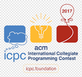
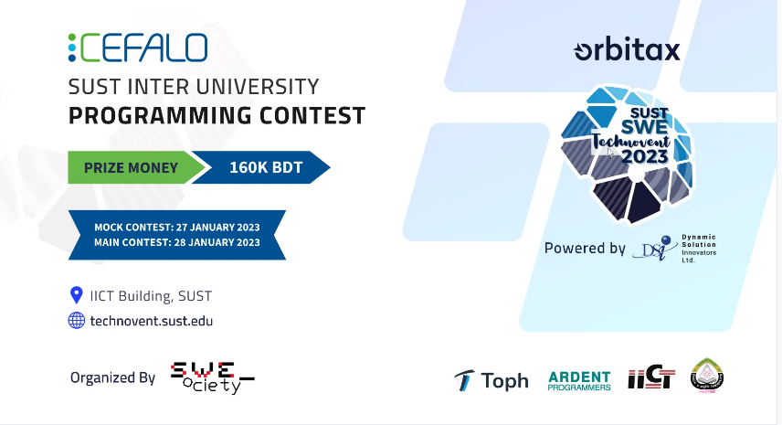

   

<h1 align = "center">  Khalid Abdullah </h1>

<!--    |  |  |
 -->

  

     My Dream
  

  <ul>
      <li><i> Representing <b> Bangladesh </b> at the  GLOBAL Arena and wave the Flag </i>
      
  </ul>

  

     Fun Fact
  

You don't need money to give a star    If you  like my readme , give it a star    😉😉

  

 
# About Me 
   
   
  

  <ul>
    <li style="margin-bottom: 7px;"><b>  ACM ICPC Dhaka Regionalist</b> 
    <li style="margin-bottom: 7px;"><b>Problem-Setter</b>
    <li style="margin-bottom: 7px;"><b> Programming Mentor</b>
    <li style="margin-bottom: 7px;"><b>Competition Organizer </b>
    <!-- <li style="margin-bottom: 7px;"><b> </b> -->
    <li style="margin-bottom: 7px;"><b> Debater</b>
  </ul> 
   

- **My Portfolio** - 
- **My LinkedIn** - 
- **ICPC Credential** - 

 

# Connect with Me

   
<ul>
  <li style="margin-bottom: 5px;"> 
  <li style="margin-bottom: 5px;">       
  <li style="margin-bottom: 5px;"> 
  <li style="margin-bottom: 5px;">
  <li style="margin-bottom: 5px;">
</ul>

  

<!-- |Preview|Project Name|Frontend|Authentication|Backend|Database|Links|
|-|-|-|-|-|-|-|
||<b>Tourist</b>|  | ||   | [Source Code](https://github.com/khalid586/Tourist)    [Live website](https://tourist-fa667.web.app)|
||    <b>Books Buy</b>|  | ||   | [Source Code](https://github.com/khalid586/Books-buy)    [Live website](https://books-buy1.web.app/)| -->
<!-- 
### Frontend projects (React)
|Preview|Project Name|Frontend|Authentication|Links|
|-|-|-|-|-|
||<b>Estate</b>|  | | [Source Code](https://github.com/khalid586/Estate)   [Live website](https://real-estate-auth-b141a.web.app/)|
||<b>Books of Khalid</b>|  | - | [Source Code](https://github.com/khalid586/Books-of-Khalid)   [Live website](https://books-of-khalid.netlify.app/)|
||<b>Book My Recipe</b>|  | - | [Source Code](https://github.com/khalid586/Book-My-Recipe)   [Live website](https://book-my-recipe.netlify.app/)|

### Frontend projects (Javascript)
|Preview|Project Name|Description|Frontend|Links|
|-|-|-|-|-|
||<b>Book my seat</b>|A bus ticket booking app demo created using javascript|   |[Source Code](https://github.com/khalid586/Book-My-Seat)   [Live website](https://khalid586.github.io/Book-My-Seat)| -->

 

<h2 align="center">👨‍💻 Competitive Programming </h2>

|||
|-|-|
|||

<!--       

 -->

#  Github Stats

<table>
      <thead>
            <tr>
                  <th>
                        

                  </th>
                  <th>
                        
 

                  </th>
            </tr>
      </thead>
</table>

 

#  Language & Tools

|Frontend|Backend|Database|Languages|Others|
|-|-|-|-|-|
|   ||   |      ||

<b>Competitive Rankings</b>

#   

-  Ranked <b>`81` st  </b> in Codechef October Challenge 2021
-  Ranked `127`th in ICPC Asia Regional 2021 Onsite Round
-  Ranked `131`st in ICPC Asia Dhaka Regional 2022 Onsite Round
-  Ranked <b>`268`th(out of 1700+ registered teams) in ICPC Asia Dhaka Regional online preli 2021 and qualified for Onsite Round
-  Ranked `398`th(out of 1600+ registered teams) in ICPC Asia Dhaka Regional online preli 2022 and qualified for Onsite Round
-  Ranked  <b>`614`th (out of 5000+ registered participants) in  Codechef Code senso 
-  Ranked <b> `3428`th(out of 8500+ registered participants) in  Codeforces Round 773 (Div. 2)
- Ranked <b>`4`th</b> at Intra University LFR competition

    
    
</ul>

###  

|Organizer| Contest Title                                                                                                                                                                                                    | Host | Rank | QUALIFIED Participants | Solved  Problems | Result                                                                                                                                                                        | Standings                                                                                                                                                                 |
|--------|------------------------------------------------------------------------------------------------------------------------------------------------------------------------------------------------------------------|------|------|------------------------|---------------------|-------------------------------------------------------------------------------------------------------------------------------------------------------------------------------|---------------------------------------------------------------------------------------------------------------------------------------------------------------------------|
|  |  ICPC Asia Dhaka Regional 2023 | BUBT | 143  | 224                    | 3                   |  Honourable Mention |  |
|  |  ICPC Asia Dhaka Regional 2022 | GUB  | 131  | 162                    | 2                   |  Honourable Mention |             |
|  |  ICPC Asia Dhaka Regional 2021 | BUBT | 127  | 165                    | 2                   |  Honourable Mention | <a href = "https://algo.codemarshal.org/contests/dhaka-21-main/standings"><b></a>     |
| | Inter University Programming Contest                                                                                                                                                                             | SUST | 80   | 120          | 1                   | 💹 **Rating increased by 100+** |                              |

### 

| Organizer                                                                               | Contest Title                             | Rank | Registered participants |Result| Standings                                                                                                                                                                                                                     |
|-----------------------------------------------------------------------------------------|-------------------------------------------|------|-------------------------|------|-------------------------------------------------------------------------------------------------------------------------------------------------------------------------------------------------------------------------------|
|             | ICPC Asia Dhaka Regional 2023 Preliminary | 202  | 2400+                   |✅ **Qualified to Regional Round**| |                                                                                                                                                                                                                              |
|             | ICPC Asia Dhaka Regional 2022 Preliminary | 398  | 1600+                   |✅ **Qualified to Regional Round**| <a href = "https://algo.codemarshal.org/contests/icpc-dhaka-22-preli/standings?page=2"> <b></a>                                       |
|             | ICPC Asia Dhaka Regional 2021 Preliminary | 268  | 1700+                   |✅ **Qualified to Regional Round**|                                            |
|  | Codechef October Challenge 2021           | 81   | 20000+                  |💹 **Rating increased 80+** |  |
|  | Codechef Code senso                       | 614  | 5000+                   |💹 **Rating increased 50+** |  |

Hacktoberfest 2023

 

<!-- 
    -->

<!--         -->

<!--

### 🔝 Top Contributed Repo

-->

<!--
## 🏆 GitHub Trophies

// Most used language

-->

<!--

